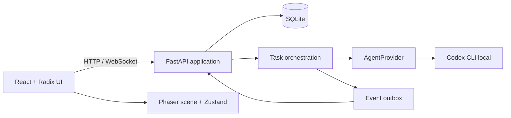
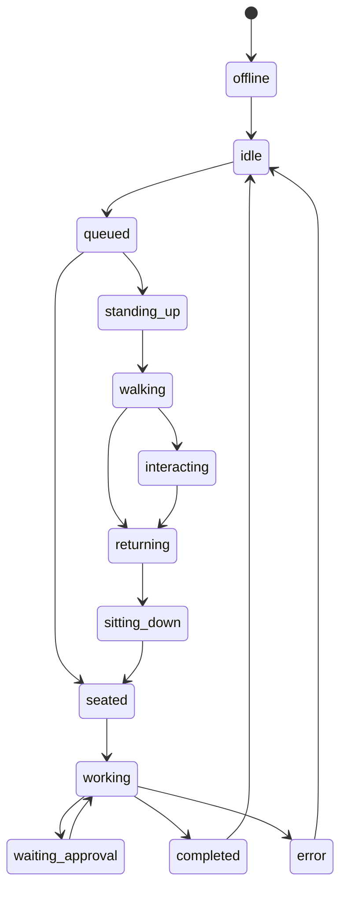
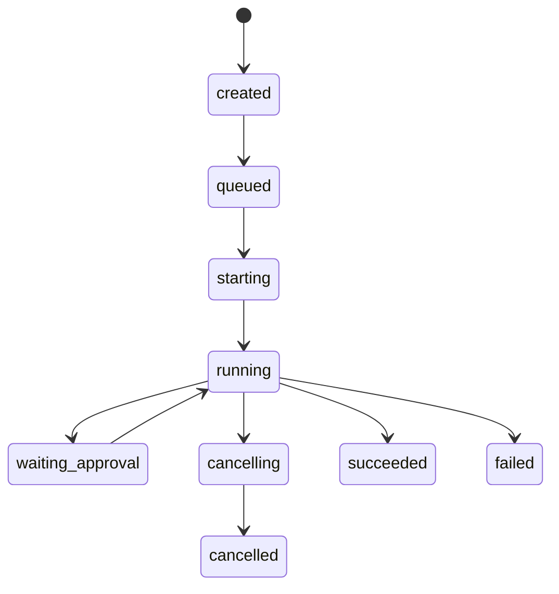

# Agents Room: arquitetura do MVP

## Resultado mensurável

O MVP é aceito quando um workspace local persiste até oito agentes, envia uma tarefa ao Codex por agente, transmite eventos pelo WebSocket e mostra na cena uma interação solicitada pelo backend sem colisões. As métricas iniciais são `task_started_to_first_event_ms`, `route_replans`, `interaction_route_failures` e `write_lock_wait_ms`.

## Direção de produto e interface

**Domínio:** estação de trabalho, quadro de operações, planta de escritório, fila de aprovação, trilha de auditoria e sessão de agente.

**Mundo de cor:** céu visto pelo vidro ao norte (`#9ccfee`), vidro azulado (`#c8e8f0`), madeira clara (`#c99a65`), grafite de equipamento (`#25303a`), plantas (`#5c8b67`), aviso âmbar (`#d89a34`) e execução verde-água (`#4cae9b`).

**Assinatura:** a sala é a projeção direta de eventos operacionais reais. Um balão de conversa, rota e indicador de tarefa só aparecem a partir de um evento persistido, nunca de comportamento decorativo aleatório.

**Defaults rejeitados:** cards de métricas no centro são substituídos pela cena; três sidebars genéricas são substituídas por catálogo, cena e inspector; cores por agente são substituídas por aparência, enquanto cor comunica apenas estado.

O layout usa 8 px como base, superfícies grafite em elevação discreta e bordas translúcidas. Tipografia: `Inter` para texto e `JetBrains Mono` apenas para sessão, caminho e eventos. A cena recebe a maior área; os painéis existem para operar a cena, não para competir com ela.

## Módulos e limites



`frontend/` contém somente UI, cache de API e estado transitório da cena. `backend/` é a fonte de verdade para entidades, permissões, tarefas e eventos. O frontend nunca chama o Codex. O Phaser traduz eventos em animações e posições, mas não decide tarefas nem permissões.

### Backend

- `api`: rotas HTTP e WebSocket, valida os contratos Pydantic.
- `domain`: regras de agentes, tarefas, delegação, aprovação e locks de escrita.
- `providers`: `AgentProvider` e `CodexAgentProvider`; nenhuma outra camada conhece a CLI.
- `persistence`: SQLAlchemy, Alembic e SQLite.
- `events`: outbox sequencial por workspace e broadcast WebSocket.
- `scene`: validação de grid, estação, pathfinding e reservas. O backend emite rotas; o cliente interpola a animação.

### Frontend

- `api`: TanStack Query e WebSocket com reconexão por `sequence`.
- `scene`: Phaser isolado em um componente React, com grid, A*, depth sorting e câmera.
- `stores`: Zustand apenas para seleção, modo, câmera e estado visual derivado dos eventos.
- `features`: catálogo, inspector, tarefas, aprovações e log de eventos. React Hook Form + Zod valida criação e edição. dnd-kit cobre HTML para HTML e um bridge de drop converte a posição de tela para a grade Phaser.

## Modelo de dados

IDs são UUIDs. Datas são UTC ISO-8601. JSON é usado apenas para estruturas variáveis, não como substituto de relações.

| Tabela | Campos centrais | Relações / regras |
|---|---|---|
| `workspaces` | `id`, `name`, `project_root`, `room_width`, `room_height`, `layout`, `settings` | `project_root` é raiz autorizada e validada por caminho resolvido. |
| `agents` | `id`, `workspace_id`, `name`, `role`, `description`, `appearance`, `visual_status`, `base_x`, `base_y`, `current_x`, `current_y`, `direction`, `permission` | máximo 8 por workspace; uma estação por agente. |
| `workstations` | `id`, `workspace_id`, `agent_id`, `x`, `y`, `orientation`, `desk`, `chair`, `computer`, `interaction_points` | estação é uma unidade movida no modo edição. |
| `skills` | `id`, `manifest`, `instructions`, `version`, `compatibility`, `recommended_permission` | catálogo local; dependências no manifesto. |
| `plugins` | `id`, `manifest`, `configuration_schema` | inclui skills/integrations declaradas. |
| `agent_skills` | `agent_id`, `skill_id`, `enabled` | unique `(agent_id, skill_id)`. |
| `agent_plugins` | `agent_id`, `plugin_id`, `enabled` | unique `(agent_id, plugin_id)`. |
| `agent_sessions` | `agent_id`, `provider`, `external_session_id`, `last_resumed_at` | uma sessão lógica Codex por agente. |
| `tasks` | `id`, `workspace_id`, `agent_id`, `parent_task_id`, `prompt`, `state`, `result`, `access_mode`, `delegation_depth`, `created_at`, `finished_at` | máximo uma ativa por agente; profundidade e subtarefas limitadas. |
| `task_events` | `id`, `task_id`, `sequence`, `type`, `summary`, `payload`, `created_at` | auditável; nunca armazena chain of thought ou tokens. |
| `agent_interactions` | `id`, `source_agent_id`, `target_agent_id`, `task_id`, `kind`, `summary`, `state`, `started_at`, `completed_at` | uma visualmente ativa por agente. |
| `workspace_events` | `id`, `workspace_id`, `sequence`, `type`, `source_agent_id`, `target_agent_id`, `task_id`, `payload`, `created_at` | outbox, unique `(workspace_id, sequence)`. |
| `approvals` | `id`, `task_id`, `kind`, `summary`, `state`, `requested_at`, `decided_at` | decisão explícita e auditável. |

Índices: `tasks(agent_id, state)`, `tasks(workspace_id, state)`, `workspace_events(workspace_id, sequence)`, `agent_interactions(source_agent_id, state)` e `agent_interactions(target_agent_id, state)`.

## Máquinas de estado

Estados visual e de tarefa são independentes. O primeiro é dirigido pelo evento e o segundo pela orquestração.





Transições inválidas retornam `409`. Cancelamento é idempotente. Uma tarefa `running` pode coexistir com o agente visualmente `returning`.

## Contrato WebSocket

Endpoint: `ws://127.0.0.1:<port>/ws/workspaces/{workspace_id}`. Na conexão, o cliente informa a última sequência recebida. O servidor reproduz eventos posteriores e então faz broadcast em ordem.

```json
{
  "id": "01J...",
  "type": "agent.interaction.requested",
  "workspaceId": "01J...",
  "sourceAgentId": "01J...",
  "targetAgentId": "01J...",
  "taskId": "01J...",
  "sequence": 104,
  "timestamp": "2026-07-31T15:04:05Z",
  "payload": { "kind": "review_request", "summary": "Solicitando revisão do serviço de autenticação." }
}
```

`payload` é versionado por tipo. Eventos aceitos no MVP: todos os eventos listados na especificação, mais `approval.decided` e `workspace.layout.saved`. Eventos de texto expõem apenas `summary`, resultado normalizado e metadados seguros. Nunca incluem prompt interno, tokens, variáveis de ambiente, saída crua que possa conter segredo ou cadeia de pensamento.

## Grade, rota e profundidade

O mundo usa células inteiras `(x, y)` com norte em `y - 1`. Configuração inicial: 24 x 16 células, `tileWidth=64`, `tileHeight=32`. A origem visual está no centro da borda norte.

```text
screenX = originX + (gridX - gridY) * tileWidth / 2
screenY = originY + (gridX + gridY) * tileHeight / 2
gridX = ((screenX - originX) / (tileWidth / 2) + (screenY - originY) / (tileHeight / 2)) / 2
gridY = ((screenY - originY) / (tileHeight / 2) - (screenX - originX) / (tileWidth / 2)) / 2
```

O mapa contém `walkable`, `blocked`, `movementCost`, `reservationUntil` e `occupantAgentId`. A* usa vizinhança cardinal e Manhattan, pois a animação é cardinal. Antes de cada passo, o agente reserva a célula seguinte. Conflito ou rota bloqueada dispara recálculo; falta de rota emite `agent.route.failed` e conclui a interação visual como `cancelled`. Profundidade é `screenY` dos pés para agentes e base para móveis. Camadas frontais de móveis altos são separadas somente quando um asset exigir.

## Segurança e concorrência

- Uvicorn somente em `127.0.0.1`; CORS limita a origem Vite/Electron local.
- Caminhos são resolvidos com `Path.resolve()` e devem estar sob `workspace.project_root`; symlinks fora da raiz são recusados.
- Só há `read_only` e `workspace_write`. Ações sensíveis criam `approvals` e a CLI não é liberada até decisão positiva.
- A orquestração mantém semáforo global de três tarefas, lock por agente e lock de escrita por `project_root`. Tarefas `read_only` não tomam o lock de escrita.
- Delegação: profundidade máxima 2, máximo 4 subtarefas por raiz, timeout configurável e detecção de ancestral para impedir ciclos. Cancelamento em cascata é configuração do workspace.

## Estrutura de diretórios

```text
agents-room/
  assets/                         # fornecidos; usados após POC de cena
  docs/architecture.md
  backend/
    app/
      api/ domain/ events/ persistence/ providers/ scene/
    alembic/
    tests/                        # gate tests, sem rede, <2 s
    evals/                        # smoke Codex opt-in
    requirements.txt
    README.md
  frontend/
    src/
      api/ components/ features/ scene/ stores/ lib/
    public/assets/
    tests/
  contracts/
    events.schema.json
  electron/                        # somente depois do MVP web estável
```

## Backlog por fases

| Fase | Entrega | Critério de saída |
|---|---|---|
| 0 | POC Codex local | detecta CLI, inicia tarefa controlada, normaliza evento e permite cancelamento. |
| 1 | Fundação web e cena | React/Vite/Phaser coexistem; grid, conversões e câmera passam testes. |
| 2 | Navegação | A*, colisão, reservas, replanejamento e depth sorting demonstrados. |
| 3 | Estado persistido | SQLite/Alembic, CRUD de agentes/estações, layout salvo e modo edição. |
| 4 | Operação | catálogo de skills/plugins, tarefas Codex, WebSocket, inspector, histórico. |
| 5 | Colaboração segura | interação visual, delegação limitada, aprovações, locks e auditoria. |
| 6 | Fechamento web | testes, evals, acessibilidade, tratamento de falhas e polimento com assets fornecidos. |
| 7 | Desktop | Electron inicia/encerra backend e mantém localhost. |

## Critérios de teste

- Gate backend: transições de estado, limites de agente/tarefa/delegação, validação de raiz, lock de escrita, serialização de evento e parse do adapter.
- Gate frontend: conversões isométricas, A* respeita bloqueio/reserva, depth por pés, seleção, arrasto de estação e reducers de evento.
- Integração: WebSocket reproduz sequência; reinício mantém layout; cancelamento é idempotente; duas escritas no mesmo projeto serializam.
- E2E: criar agente, atribuir skill, iniciar tarefa, receber evento, solicitar aprovação, cancelar e persistir.
- Eval periódico Codex: prompt curto e não destrutivo; valida disponibilidade, sessão, evento normalizado e ausência de dados sensíveis. Passa com 100% das quatro asserções.

## Riscos técnicos

| Risco | Impacto | Mitigação |
|---|---|---|
| Formato/eventos da CLI variam | alto | adapter versionado, normalização tolerante e POC antes do restante. |
| Concorrência da CLI por sessão | alto | um processo por agente, locks no orquestrador e cancelamento explícito. |
| Assets não serem spritesheets | médio | placeholder programático até contrato de frame ser validado; não fatiar assets arbitrariamente. |
| Cena divergir do backend | alto | servidor emite rota/evento; Phaser só anima e reporta conclusão visual. |
| Deadlock de rota | médio | reservas com expiração, replanejamento limitado e cancelamento registrado. |
| Escrita simultânea no repo | alto | lock por raiz e aprovação para operações sensíveis. |
| Electron/Python empacotamento | médio | deixar após MVP web, com processo filho e porta efêmera localhost. |

## Prova de conceito mínima

A POC só valida o contrato de integração: localiza `codex`, monta uma execução não interativa com diretório explicitamente autorizado, consome JSONL, extrai um identificador de sessão quando presente, normaliza eventos sem propagar conteúdo sensível e encerra o processo quando solicitado. Ela não cria banco, tela, assets ou tarefas reais. `backend/evals/codex_provider_smoke.py` executa a chamada real apenas com `RUN_CODEX_EVAL=1`.
